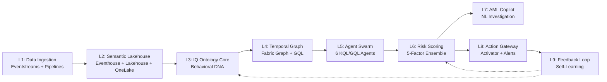

# 🛡️ SENTINEL MESH — Complete Deep Dive Analysis

> [!NOTE]
> I have read **every single file** across all folders in your workspace. Below is a complete understanding of your project, what was built, what went wrong, and where things stand now.

---

## 1. Project Overview

**SENTINEL MESH** is a **9-layer cognitive AML (Anti-Money Laundering) detection framework** built natively on **Microsoft Fabric**. It was designed for the **Hack2Future hackathon** to detect complex money laundering patterns (structuring, circular flows, shadow links) in real-time with sub-second latency.

| Attribute | Detail |
|-----------|--------|
| **Platform** | 100% Microsoft Fabric (Eventstreams, Eventhouse, Lakehouse, Graph, Activator) |
| **User** | Vinay |
| **Azure OpenAI** | `gpt-4.1` deployment on `project62071150-resource.openai.azure.com` |
| **Eventstream** | Connected via `.env` → `esehbyzeqq1lz30rpxhpy1.servicebus.windows.net` |
| **Workspace Name** | `SentinelMesh_AML_POC` |

---

## 2. Project Directory Structure

```
hack2future/
├── .env                              # Fabric Eventstream connection string ✅
├── README.md                         # Project overview ✅
├── docs/                             # Documentation & diagrams
│   ├── SENTINEL_MESH_Blueprint.pptx  # PowerPoint (binary)
│   ├── SENTINEL_MESH_Deep_Dive.docx  # 47-page whitepaper (binary)
│   ├── SENTINEL_MESH_Deep_Dive_v2.docx
│   ├── architecture_diagram.html     # Interactive HTML 9-layer diagram ✅
│   ├── architecture_overview.html    # Interactive workspace diagram
│   ├── conversation_history.md       # Session history & context log ✅
│   ├── implementation_plan.md        # Plan with open questions ✅
│   ├── roadmap_diagram.html          # Interactive sprint plan
│   ├── sentinel_mesh_blueprint.md    # Full 492-line architecture blueprint ✅
│   └── simple_flow_diagram.html      # Simplified flow
│
├── implementation/                   # 🆕 NEW IMPLEMENTATION (all empty scaffolding!)
│   ├── agents/                       # ❌ EMPTY
│   ├── config/                       # ❌ EMPTY
│   ├── copilot/                      # ❌ EMPTY
│   ├── dashboard/                    # ❌ EMPTY
│   ├── data_simulator/               # ❌ EMPTY
│   ├── kql/                          # ❌ EMPTY
│   └── notebooks/                    # ❌ EMPTY
│
└── old_implementation/               # Previous POC code (has issues)
    ├── implimentation_guide.md       # 337-line step-by-step guide ✅
    ├── task.md                       # Task checklist (Phase 7 incomplete) ✅
    ├── generators/
    │   ├── generate_blueprint_ppt.py # 51KB PPT generator
    │   └── generate_sentinel_doc.py  # 136KB Doc generator
    ├── learning_phase/               # Experimental/learning scripts
    │   ├── L7_SynapseML_OpenAI_SAR.ipynb
    │   ├── fact_sar_narratives.csv   # Generated SAR narratives ✅
    │   ├── generate_local_dna_csv.py # Hard-coded DNA data ⚠️
    │   ├── run_fabric_live_sar.py    # Live Fabric SAR generator ⚠️
    │   ├── run_local_sar.py          # Local SAR generator ⚠️
    │   ├── send_vinayak_anomaly.py   # Hard-coded test transactions ⚠️
    │   └── send_vinayak_txn.py       # Hard-coded test transaction ⚠️
    └── src/
        ├── data_simulator/
        │   ├── generate_mock_dimensions.py  # Hard-coded dimension CSVs ⚠️
        │   ├── mock_data/                   # CSV dimension files
        │   │   ├── dim_account.csv
        │   │   ├── dim_behavioral_dna.csv
        │   │   ├── dim_customer.csv
        │   │   └── dim_merchant.csv
        │   ├── requirements.txt
        │   ├── send_dynamic_loop.py         # Hard-coded loop transactions ⚠️
        │   └── simulator.py                 # Main simulator (367 lines) ⚠️
        ├── kql/
        │   ├── L2_eventhouse_ddl.kql        # Table schema DDL ✅
        │   ├── L5_swarm_agents.kql          # 6 agent KQL functions ✅
        │   └── L6_risk_scoring.kql          # Ensemble risk scoring ⚠️
        └── notebooks/
            ├── L3_IQ_Ontology_Setup.ipynb
            ├── L4_Fabric_Graph_GQL.ipynb
            └── create_notebooks.py
```

---

## 3. The 9-Layer Architecture (What Was Planned)



---

## 4. What Was Actually Built (Old Implementation)

| Layer | Component | Status | Notes |
|-------|-----------|--------|-------|
| **L1** | Eventstream `es_transactions` | ✅ Created | Connected via Custom App source |
| **L1** | Transaction Simulator (`simulator.py`) | ⚠️ Works but hard-coded | 3 test scenarios hard-coded (Raj Kumar, Priya, Circular) |
| **L2** | Eventhouse `SentinelMesh_Eventhouse` | ✅ Created | `fact_transactions` table DDL working |
| **L2** | Lakehouse `SentinelMesh_Lakehouse` | ✅ Created | 3 dimension tables loaded |
| **L3** | Behavioral DNA calculation | ⚠️ Notebook exists | Hard-coded DNA vectors in `generate_local_dna_csv.py` |
| **L4** | Fabric Graph / GQL | ⚠️ Notebook exists | Circular flow detection via Spark (not native Graph) |
| **L5** | 6 Swarm Agents (KQL) | ✅ Written | All 6 agents defined as KQL functions |
| **L6** | Ensemble Risk Scoring | ⚠️ Written but flawed | **All agent weights hard-coded to 35.0** (should vary) |
| **L7** | AML Copilot / SAR | ⚠️ Partial | Local & Fabric SAR scripts exist but with hard-coded data |
| **L8** | Activator alerts | 🔴 Incomplete | Guide written but Phase 7 was never finished |
| **L9** | Feedback Loop | 🔴 Not built | Was planned as "demo conceptually" |

---

## 5. 🚨 All Hard-Coded Values & Issues Found

This is the critical section — everything that needs to be eliminated in the new implementation.

### 5.1 Hard-Coded Test Scenarios (simulator.py)

| Issue | File | Details |
|-------|------|---------|
| **Raj Kumar scenario** | [simulator.py](file:///c:/Users/vinay/Documents/hack2future/old_implementation/src/data_simulator/simulator.py#L77-L162) | 6 specific deposits hard-coded (amounts, locations, device IDs, times) |
| **Priya Sharma scenario** | [simulator.py](file:///c:/Users/vinay/Documents/hack2future/old_implementation/src/data_simulator/simulator.py#L165-L188) | Single transaction hard-coded with exact device/IP match |
| **Circular flow scenario** | [simulator.py](file:///c:/Users/vinay/Documents/hack2future/old_implementation/src/data_simulator/simulator.py#L191-L251) | 3-hop loop hard-coded with fixed customer names and amounts |
| **Normal transactions** | [simulator.py](file:///c:/Users/vinay/Documents/hack2future/old_implementation/src/data_simulator/simulator.py#L34-L74) | Random but with hard-coded merchant IDs, customer ID ranges |

### 5.2 Hard-Coded Mock Dimension Data

| Issue | File | Details |
|-------|------|---------|
| **Customer dimensions** | [generate_mock_dimensions.py](file:///c:/Users/vinay/Documents/hack2future/old_implementation/src/data_simulator/generate_mock_dimensions.py#L10-L19) | 8 customers hard-coded with fixed risk scores |
| **Account dimensions** | [generate_mock_dimensions.py](file:///c:/Users/vinay/Documents/hack2future/old_implementation/src/data_simulator/generate_mock_dimensions.py#L28-L39) | 10 accounts hard-coded with fixed balances/dormancy |
| **Merchant dimensions** | [generate_mock_dimensions.py](file:///c:/Users/vinay/Documents/hack2future/old_implementation/src/data_simulator/generate_mock_dimensions.py#L47-L55) | 6 merchants hard-coded |
| **Behavioral DNA** | [generate_local_dna_csv.py](file:///c:/Users/vinay/Documents/hack2future/old_implementation/learning_phase/generate_local_dna_csv.py#L3-L9) | DNA vectors manually hard-coded instead of calculated |

### 5.3 Hard-Coded Risk Scoring (L6)

| Issue | File | Details |
|-------|------|---------|
| **Equal agent weights** | [L6_risk_scoring.kql](file:///c:/Users/vinay/Documents/hack2future/old_implementation/src/kql/L6_risk_scoring.kql#L10-L15) | All 6 agents assigned `agent_weight=35.0` — this is wrong! The blueprint says F1=35%, F2=20%, F3=20%, F4=15%, F5=10% |
| **Hard-coded factor defaults** | [L6_risk_scoring.kql](file:///c:/Users/vinay/Documents/hack2future/old_implementation/src/kql/L6_risk_scoring.kql#L28-L33) | Graph centrality default (0.10), DNA deviation (0.20), history (0.15) all hard-coded magic numbers |
| **Agent detection thresholds** | [L5_swarm_agents.kql](file:///c:/Users/vinay/Documents/hack2future/old_implementation/src/kql/L5_swarm_agents.kql#L23) | Structuring threshold 1,000,000 INR hard-coded |
| **Confidence scores** | [L5_swarm_agents.kql](file:///c:/Users/vinay/Documents/hack2future/old_implementation/src/kql/L5_swarm_agents.kql#L26) | Static confidence (0.95, 0.85, 0.89, 0.92, 0.94, etc.) |

### 5.4 Hard-Coded API Credentials

| Issue | File | Details |
|-------|------|---------|
| **Azure OpenAI API Key** | [run_local_sar.py](file:///c:/Users/vinay/Documents/hack2future/old_implementation/learning_phase/run_local_sar.py#L8) | API key in plain text in source code |
| **Azure OpenAI Endpoint** | [run_local_sar.py](file:///c:/Users/vinay/Documents/hack2future/old_implementation/learning_phase/run_local_sar.py#L9) | Endpoint hard-coded |
| **Same in Fabric live SAR** | [run_fabric_live_sar.py](file:///c:/Users/vinay/Documents/hack2future/old_implementation/learning_phase/run_fabric_live_sar.py#L14-L15) | Same API key and endpoint hard-coded again |
| **SQL Endpoint** | [run_fabric_live_sar.py](file:///c:/Users/vinay/Documents/hack2future/old_implementation/learning_phase/run_fabric_live_sar.py#L10) | Fabric SQL endpoint hard-coded |
| **Mock SAR customer data** | [run_local_sar.py](file:///c:/Users/vinay/Documents/hack2future/old_implementation/learning_phase/run_local_sar.py#L14-L33) | Customer records hard-coded for SAR generation |

### 5.5 Hard-Coded Test Scripts

| Issue | File | Details |
|-------|------|---------|
| **Vinayak single transaction** | [send_vinayak_txn.py](file:///c:/Users/vinay/Documents/hack2future/old_implementation/learning_phase/send_vinayak_txn.py#L18-L32) | Entire transaction payload hard-coded |
| **Vinayak anomaly batch** | [send_vinayak_anomaly.py](file:///c:/Users/vinay/Documents/hack2future/old_implementation/learning_phase/send_vinayak_anomaly.py#L18-L66) | 3 transactions hard-coded |
| **4-hop dynamic loop** | [send_dynamic_loop.py](file:///c:/Users/vinay/Documents/hack2future/old_implementation/src/data_simulator/send_dynamic_loop.py#L20-L84) | 4 circular transactions hard-coded |
| **Output file paths** | Multiple files | Absolute paths like `c:\Users\vinay\Documents\hack2future\...` hard-coded |

---

## 6. Current State of New Implementation

The `implementation/` folder has been scaffolded with 7 subdirectories:

| Folder | Purpose | Status |
|--------|---------|--------|
| `agents/` | Agent swarm logic | ❌ **Empty** |
| `config/` | Configuration management | ❌ **Empty** |
| `copilot/` | AML Copilot / SAR generation | ❌ **Empty** |
| `dashboard/` | Real-time monitoring UI | ❌ **Empty** |
| `data_simulator/` | Transaction streaming | ❌ **Empty** |
| `kql/` | KQL queries & DDL | ❌ **Empty** |
| `notebooks/` | Spark notebooks | ❌ **Empty** |

**Everything is ready to be built from scratch — properly this time.**

---

## 7. What You Now Have Access To

Based on your `.env`, learning phase scripts, and conversation history, you have:

| Resource | Detail | Status |
|----------|--------|--------|
| **Microsoft Fabric Workspace** | `SentinelMesh_AML_POC` | ✅ Full access |
| **Fabric Eventstream** | `es_transactions` with Custom App endpoint | ✅ Connection string in `.env` |
| **Fabric Eventhouse** | `SentinelMesh_Eventhouse` + KQL DB | ✅ Created |
| **Fabric Lakehouse** | `SentinelMesh_Lakehouse` + Delta tables | ✅ Created |
| **Azure OpenAI** | `gpt-4.1` on `project62071150-resource` | ✅ API key available |
| **Fabric SQL Endpoint** | `ctbpmuhrbb7u3igqe6acs7zm3u-...` | ✅ Available |
| **Azure Services** | Full access (per your message) | ✅ |

---

## 8. Summary of Key Flaws to Fix

> [!WARNING]
> The old implementation was essentially a **hard-coded demo** — it looked good for a hackathon presentation but couldn't adapt to real data or new scenarios.

| # | Flaw Category | Count | Impact |
|---|---------------|-------|--------|
| 1 | **Hard-coded test scenarios** (customers, amounts, locations) | 5+ scripts | Cannot test with real/new data |
| 2 | **Hard-coded API credentials** in source code | 3 files | Security risk, not portable |
| 3 | **Hard-coded risk scoring weights** (all 35.0) | L6 KQL | Incorrect risk calculations |
| 4 | **Hard-coded detection thresholds** | L5 KQL | No adaptability |
| 5 | **Hard-coded dimension data** (CSV generators) | 2 files | Fixed fake customers |
| 6 | **Hard-coded file paths** | 6+ files | Not portable |
| 7 | **No config management** | Entire project | Values scattered everywhere |
| 8 | **No feedback loop** (L9) | Architecture gap | System can't learn |
| 9 | **No dashboard** | Missing entirely | No monitoring/visualization |
| 10 | **Incomplete L8** (Action Gateway) | Only guide written | No automated alerts working |

---

## 9. What's Next?

Now that I've deeply understood everything, we need to plan the **new implementation** that:

1. **Eliminates ALL hard-coded values** → Move to config files (`.env`, `config.yaml`, or `config/` module)
2. **Makes data generation dynamic** → Configurable simulator with parameterized scenarios
3. **Properly implements risk scoring** → Correct 5-factor weights (35/20/20/15/10)
4. **Connects to real Fabric services** → Using your full Azure access
5. **Adds the missing pieces** → Dashboard, L8 Activator, L9 Feedback Loop
6. **Secures credentials** → All API keys in `.env`, never in source code

**Ready to proceed whenever you say the word!** 🚀
