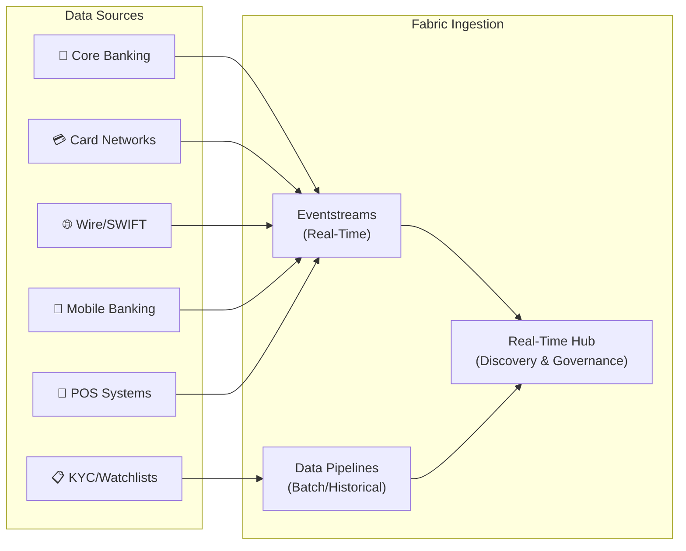
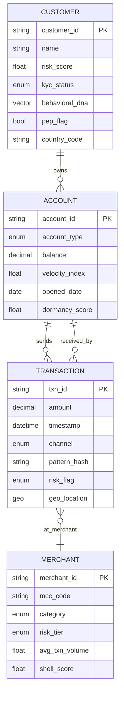
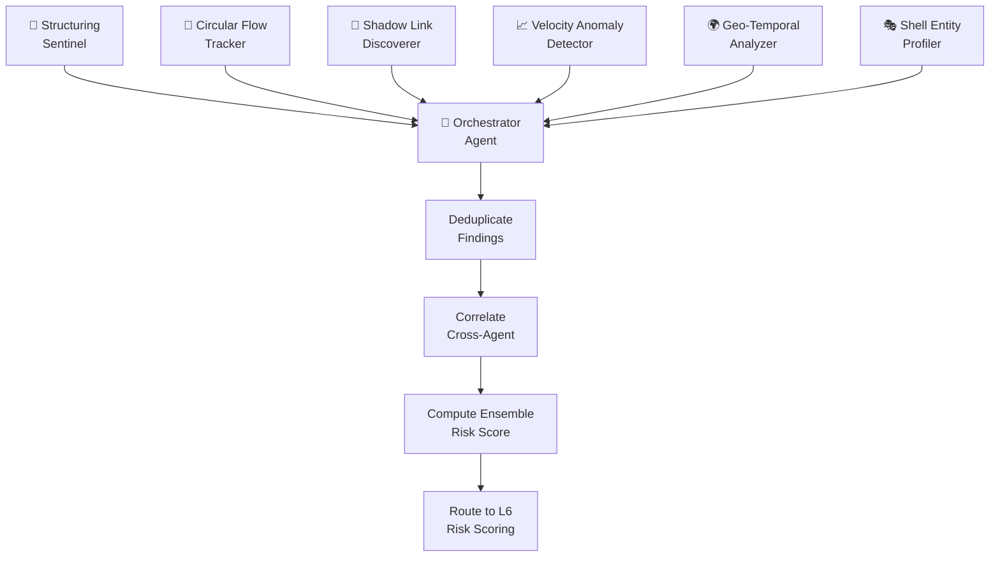
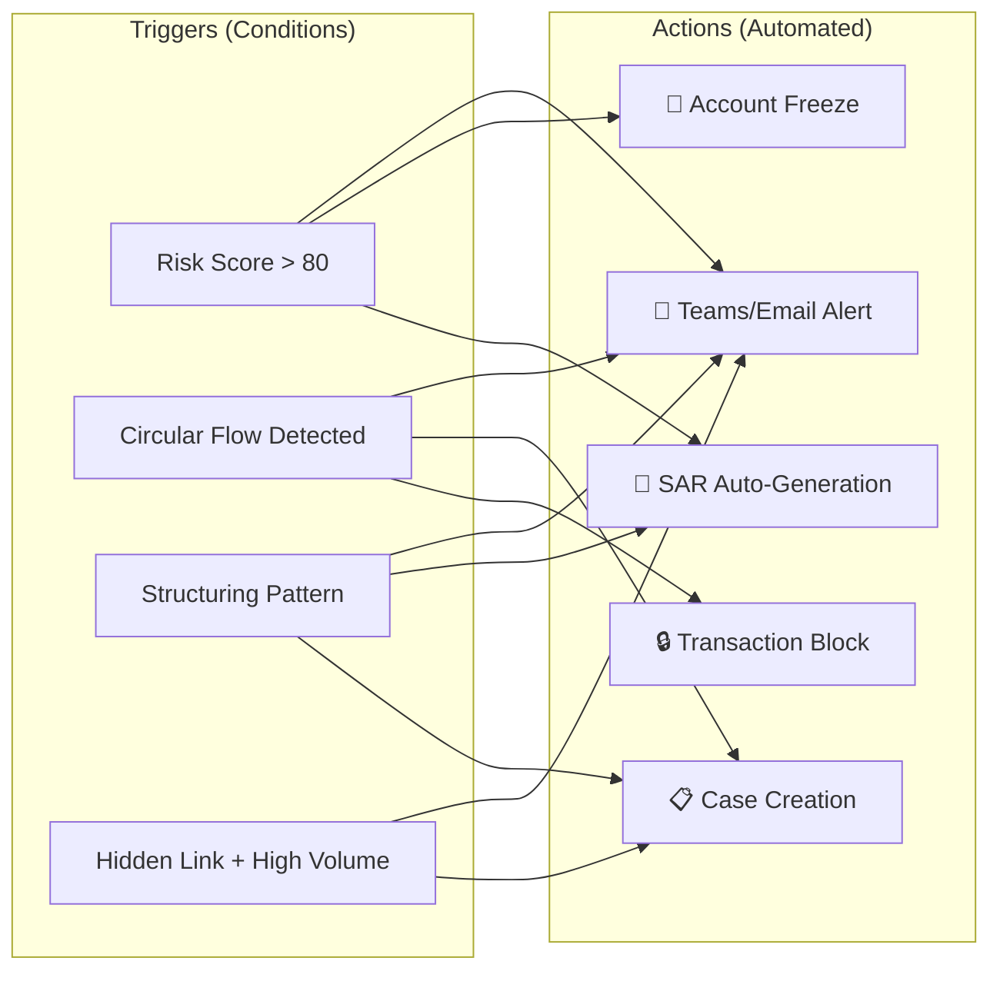
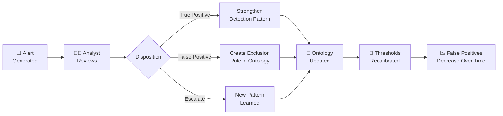
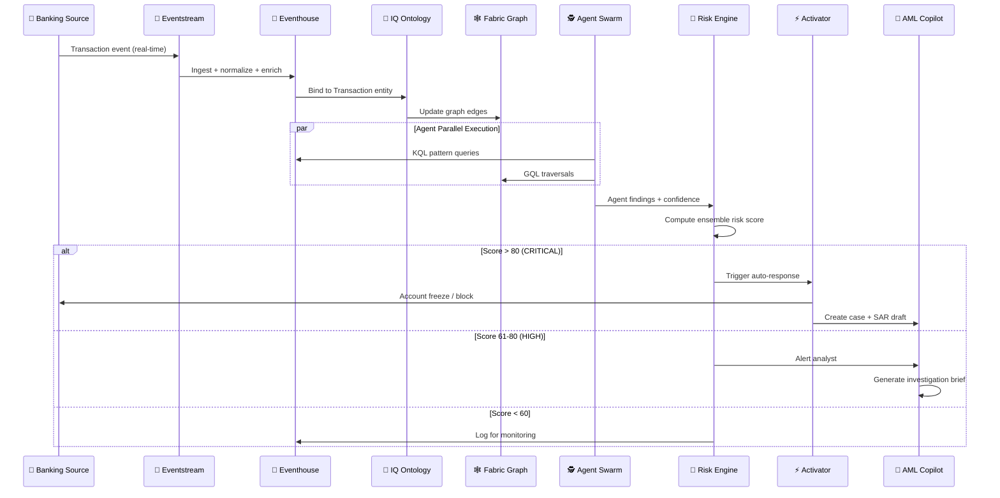

# 🛡️ SENTINEL MESH — Architecture Blueprint
## Real-Time AML Suspicious Transaction Detection using Microsoft Fabric IQ Ontology
### *Semantic ENTity INtelligence & Layered Detection Framework*

---

> [!IMPORTANT]
> This is a **novel, first-of-its-kind architecture** that combines Microsoft Fabric IQ Ontology, Temporal Knowledge Graphs, and an Autonomous Cognitive Agent Swarm into a self-learning AML detection mesh. No existing blueprint combines these capabilities in this topology.

---

## 1. Executive Summary

**SENTINEL MESH** is a multi-layered cognitive architecture for real-time Anti-Money Laundering (AML) detection. Unlike traditional linear ETL-to-alert pipelines, it uses a **mesh topology** where every layer feeds intelligence back into a central IQ Ontology core — creating a system that gets smarter with every transaction it processes.

| Metric | Target |
|--------|--------|
| Detection Latency | < 2 seconds |
| Precision (True Positive Rate) | ≥ 97% |
| False Positive Reduction | 60% vs. rule-based systems |
| Pattern Types Detected | Structuring, Circular Flows, Hidden Links |
| Autonomous Agents | 6 specialized + 1 orchestrator |

---

## 2. Architecture Overview — 9-Layer Cognitive Mesh

```mermaid
%%{init: {'theme': 'base', 'themeVariables': {'fontSize': '18px', 'fontFamily': 'Segoe UI', 'primaryColor': '#1e293b', 'primaryTextColor': '#f8fafc', 'primaryBorderColor': '#3b82f6', 'lineColor': '#60a5fa', 'secondaryColor': '#0f172a', 'tertiaryColor': '#1e293b', 'edgeLabelBackground': '#0f172a'}, 'flowchart': {'nodeSpacing': 80, 'rankSpacing': 100, 'padding': 25, 'htmlLabels': true, 'curve': 'basis'}}}%%

graph LR
    subgraph MESH["🛡️ SENTINEL MESH — 9-Layer Cognitive Architecture"]
        direction LR

        L1["📡 <b>LAYER 1: DATA INGESTION FABRIC</b><br/><br/>Eventstreams &nbsp;•&nbsp; Real-Time Hub &nbsp;•&nbsp; Batch Pipelines<br/>Core Banking &nbsp;•&nbsp; Card Networks &nbsp;•&nbsp; SWIFT &nbsp;•&nbsp; Mobile &nbsp;•&nbsp; POS"]

        L2["💾 <b>LAYER 2: UNIFIED SEMANTIC LAKEHOUSE</b><br/><br/>🔴 Hot: Eventhouse KQL DB — last 90 days<br/>🟡 Warm: Lakehouse Delta Tables — historical<br/>🔵 Cold: OneLake Archive — 7+ year compliance"]

        L3["🧠 <b>LAYER 3: IQ ONTOLOGY CORE — THE BRAIN</b><br/><br/>Entity Types: Customer • Account • Transaction • Merchant<br/>Relationships: owns • sends • received_by • linked_to<br/>🧬 Behavioral DNA Fingerprinting per Entity"]

        L4["🕸️ <b>LAYER 4: TEMPORAL KNOWLEDGE GRAPH</b><br/><br/>Fabric Graph &nbsp;•&nbsp; GQL Queries<br/>Cycle Detection &nbsp;•&nbsp; Community Detection<br/>Centrality Analysis &nbsp;•&nbsp; Path Tracing &nbsp;•&nbsp; Entity Resolution"]

        L5["🕵️ <b>LAYER 5: COGNITIVE AGENT SWARM</b><br/><br/>🔢 Structuring Sentinel &nbsp;&nbsp; 🔄 Circular Flow Tracker<br/>👻 Shadow Link Discoverer &nbsp;&nbsp; 📈 Velocity Anomaly Detector<br/>🌍 Geo-Temporal Analyzer &nbsp;&nbsp; 🎭 Shell Entity Profiler<br/>🎯 Orchestrator Agent — Correlation Engine"]

        L6["🎯 <b>LAYER 6: ADAPTIVE RISK SCORING</b><br/><br/>Multi-Factor Ensemble Score 0–100<br/>🟢 0–30 Low &nbsp; 🟡 31–60 Medium &nbsp; 🟠 61–80 High &nbsp; 🔴 81–100 Critical<br/>Dynamic Threshold Recalibration"]

        L7["🤖 <b>LAYER 7: AML COPILOT</b><br/><br/>Natural Language Investigation<br/>Auto-Generated Case Narratives<br/>Ontology-Grounded Reasoning"]

        L8["⚡ <b>LAYER 8: ACTION &amp; COMPLIANCE GATEWAY</b><br/><br/>🚨 Teams/Email Alerts &nbsp;&nbsp; 🧊 Account Freeze<br/>📄 SAR Auto-Generation &nbsp;&nbsp; 📋 Case Creation &nbsp;&nbsp; 🔒 Txn Block"]

        L9["🔄 <b>LAYER 9: SELF-LEARNING FEEDBACK LOOP</b><br/><br/>Analyst Disposition Capture<br/>Auto-Calibration of Thresholds &amp; Weights<br/>Ontology Evolution &nbsp;•&nbsp; Exclusion Rules"]
    end

    L1 ==> L2
    L2 ==> L3
    L3 ==> L4
    L4 ==> L5
    L5 ==> L6
    L6 ==> L7
    L6 ==> L8
    L7 ==> L8
    L8 ==> L9
    L9 -.->|"🔄 Feedback — Ontology Updated"| L3
    L9 -.->|"🎯 Threshold Recalibration"| L6
    L3 -.->|"🧠 Semantic Context"| L5
    L3 -.->|"🧠 Grounding"| L7

    style MESH fill:#0a0a1a,stroke:#3b82f6,stroke-width:2px,color:#94a3b8
    style L1 fill:#0c2d48,stroke:#06b6d4,stroke-width:2px,color:#e0f2fe
    style L2 fill:#1a1a3e,stroke:#8b5cf6,stroke-width:2px,color:#ede9fe
    style L3 fill:#1a1a4e,stroke:#00d4ff,stroke-width:4px,color:#fff
    style L4 fill:#1e1b3a,stroke:#a78bfa,stroke-width:2px,color:#ede9fe
    style L5 fill:#1a1a4e,stroke:#7c3aed,stroke-width:3px,color:#fff
    style L6 fill:#2a1a1a,stroke:#f59e0b,stroke-width:2px,color:#fef3c7
    style L7 fill:#1a2a2a,stroke:#14b8a6,stroke-width:2px,color:#ccfbf1
    style L8 fill:#2a1a1a,stroke:#ef4444,stroke-width:2px,color:#fecaca
    style L9 fill:#1a2a1a,stroke:#10b981,stroke-width:3px,color:#d1fae5
```



### What Makes This Novel?

| Traditional AML Architecture | SENTINEL MESH |
|------------------------------|---------------|
| Linear pipeline (Ingest → Rules → Alert) | Mesh topology with bidirectional feedback |
| Static rule thresholds | Self-calibrating thresholds via feedback loop |
| Siloed graph analysis (separate tool) | Fabric-native Graph built from Ontology |
| Manual investigation | AML Copilot with ontology-grounded reasoning |
| Single detection engine | 6 specialized agents collaborating via shared ontology |
| No behavioral memory | Behavioral DNA fingerprinting per entity |

---

## 3. Layer-by-Layer Deep Dive

### Layer 1: Data Ingestion Fabric 📡



| Component | Role | Data Type |
|-----------|------|-----------|
| **Eventstreams** | Real-time ingestion with in-flight transformations | Transactions, card auth, wire transfers |
| **Data Pipelines** | Scheduled batch loads | KYC records, watchlists, historical data |
| **Real-Time Hub** | Centralized stream discovery & governance | All streaming sources |

---

### Layer 2: Unified Semantic Lakehouse 💾

| Store | Engine | Data | Temperature |
|-------|--------|------|-------------|
| **Eventhouse (KQL DB)** | Kusto | Last 90 days transactions | 🔴 Hot |
| **Lakehouse (Delta)** | Spark | Historical + dimensional data | 🟡 Warm |
| **OneLake Archive** | ADLS Gen2 | Compliance archives (7+ years) | 🔵 Cold |

**Key Design Decision:** Transactions flow into **Eventhouse** for sub-second KQL queries. Dimensional data (Customer, Account, Merchant profiles) lives in **Lakehouse Delta tables**. The Ontology binds across both seamlessly.

---

### Layer 3: IQ Ontology Core 🧠 *(The Brain)*

> [!NOTE]
> This is the **central nervous system** of SENTINEL MESH. Every other layer references the Ontology for semantic context.

#### Entity Type Definitions



> [!NOTE]
> **Self-Referencing Relationship:** `CUSTOMER ↔ CUSTOMER` (`linked_to`) — This many-to-many relationship captures hidden connections between customers (shared devices, IPs, phone numbers, addresses, or beneficial ownership). It is the primary input for the **Shadow Link Discoverer** agent, which flags undeclared relationships as suspicious.

#### Ontology Bindings (Physical → Semantic)

| Entity Type | Bound To | Source |
|-------------|----------|--------|
| `Customer` | `lakehouse.dim_customer` | Lakehouse Delta |
| `Account` | `lakehouse.dim_account` | Lakehouse Delta |
| `Transaction` | `eventhouse.fact_transactions` | Eventhouse KQL DB |
| `Merchant` | `lakehouse.dim_merchant` | Lakehouse Delta |

#### 🧬 Behavioral DNA — The Novel Element

Each entity gets a **multi-dimensional behavioral fingerprint** (`behavioral_dna` vector) computed from:

- **Transaction velocity** (txn count per hour/day/week)
- **Amount distribution** (mean, stddev, percentiles)
- **Temporal patterns** (time-of-day, day-of-week clusters)
- **Counterparty diversity** (unique receivers/senders ratio)
- **Channel mix** (ATM vs. online vs. wire ratios)
- **Geographic spread** (entropy of transaction locations)

This vector is **continuously updated** and stored as a property on the Customer and Account entities. When it drifts beyond a learned baseline, agents are triggered.

---

### Layer 4: Temporal Knowledge Graph 🕸️

Built using **Fabric Graph** on top of the Ontology. Queryable via **GQL (Graph Query Language)**.

#### What Makes It "Temporal"?

| Feature | Description |
|---------|-------------|
| **Time-Versioned Edges** | Every transaction creates a timestamped edge. Graph preserves full history. |
| **Sliding Window Views** | Agents can query the graph at any time window (last 1hr, 24hr, 7d, 30d) |
| **Constellation Snapshots** | Periodic snapshots capture the graph state — enabling "slow-burn" pattern detection across weeks/months |

#### Key Graph Algorithms Used

| Algorithm | AML Application |
|-----------|----------------|
| **Cycle Detection** | Find circular transaction flows (A→B→C→A) |
| **Community Detection** | Identify clusters of tightly connected accounts |
| **Centrality Analysis** | Find hub accounts that facilitate money movement |
| **Path Analysis** | Trace multi-hop fund flows for layering detection |
| **Entity Resolution** | Merge duplicate/similar customers across datasets |

---

### Layer 5: Cognitive Agent Swarm 🕵️

> [!TIP]
> Unlike a single monolithic detection engine, SENTINEL MESH deploys **6 specialized agents** — each an expert at one type of suspicious behavior. An **Orchestrator Agent** correlates their findings.

#### Agent Specifications

| Agent | Detection Mandate | Data Source | Query Language |
|-------|-------------------|-------------|----------------|
| **🔢 Structuring Sentinel** | Smurfing (sub-threshold deposits) | Eventhouse | KQL |
| **🔄 Circular Flow Tracker** | Round-trip/layering schemes | Fabric Graph | GQL |
| **👻 Shadow Link Discoverer** | Hidden relationships (shared devices/IPs) | Fabric Graph | GQL |
| **📈 Velocity Anomaly Detector** | Behavioral DNA drift (>3σ deviation) | Eventhouse + Ontology | KQL |
| **🌍 Geo-Temporal Analyzer** | Impossible travel, high-risk jurisdictions | Eventhouse | KQL |
| **🎭 Shell Entity Profiler** | Shell companies, dormant-to-active accounts | Lakehouse + Graph | KQL + GQL |

#### Agent Query Examples

**Structuring Sentinel (KQL):**
```kql
Transactions
| where timestamp > ago(24h)
| summarize txn_count=count(), total_amount=sum(amount) 
    by customer_id, bin(timestamp, 24h)
| where total_amount between (9000 .. 10000) and txn_count >= 3
| join kind=inner (Customers | project customer_id, risk_score, kyc_status) 
    on customer_id
| where risk_score > 0.5
| order by total_amount desc
```

**Circular Flow Tracker (GQL):**
```
MATCH path = (origin:Account)-[:sends*3..7]->(origin)
WHERE ALL(e IN relationships(path) WHERE e.timestamp > datetime('2026-04-01'))
RETURN origin.account_id, 
       length(path) AS hops,
       reduce(total = 0, e IN relationships(path) | total + e.amount) AS cycle_amount
ORDER BY cycle_amount DESC
```

**Shadow Link Discoverer (GQL):**
```
MATCH (c1:Customer)-[:uses]->(d:Device)<-[:uses]-(c2:Customer)
WHERE c1 <> c2
  AND NOT EXISTS((c1)-[:declared_relation]->(c2))
RETURN c1.name, c2.name, d.device_id, d.device_type
```

#### Orchestrator Agent — Correlation Engine



---

### Layer 6: Adaptive Risk Scoring Engine 🎯

**Multi-Factor Ensemble Score** (0-100):

| Factor | Weight | Source |
|--------|--------|--------|
| Agent consensus score | 35% | Agent Swarm (L5) |
| Graph centrality risk | 20% | Temporal Graph (L4) |
| Behavioral DNA deviation | 20% | Ontology (L3) |
| Historical risk profile | 15% | Lakehouse (L2) |
| Regulatory watchlist match | 10% | KYC data (L2) |

**Dynamic Threshold Tiers:**

| Score Range | Risk Level | Action |
|-------------|------------|--------|
| 0–30 | 🟢 Low | Log only |
| 31–60 | 🟡 Medium | Enhanced monitoring |
| 61–80 | 🟠 High | Alert analyst + enhanced due diligence |
| 81–100 | 🔴 Critical | Auto-freeze + SAR generation + escalation |

---

### Layer 7: AML Copilot 🤖

A **Fabric Data Agent** grounded in the AML Ontology. Analysts investigate using natural language.

#### Sample Copilot Interactions

| Analyst Query | Copilot Response |
|---------------|------------------|
| "Show accounts linked to C-4892 via shared devices" | Finds 3 hidden links via Device D-1102. Combined outflow: $847K. Risk: HIGH. |
| "Are there circular flows between these accounts?" | Detects 4-hop cycle: A-2201→A-5567→A-8834→A-2201. $125K rotating every 72hrs. |
| "Generate SAR narrative for case #AML-2026-0891" | Auto-generates regulatory narrative with entity details, transaction timeline, and graph visualization. |
| "What's the risk trend for Merchant M-3301?" | Shell score increased 40% in 30 days. 95% of transactions from 3 customers. Recommend review. |

---

### Layer 8: Action & Compliance Gateway ⚡

Powered by **Fabric Activator** with condition → action rules:



---

### Layer 9: Self-Learning Feedback Loop 🔄

> [!IMPORTANT]
> This is what makes SENTINEL MESH **self-evolving**. The system learns from every analyst decision.



**What auto-calibrates:**
- `behavioral_dna` baseline vectors per entity
- Agent-specific risk thresholds
- Ensemble scoring weights
- Exclusion rules for known-good patterns

---

## 4. End-to-End Data Flow



---

## 5. Technology Stack Summary

| Layer | Microsoft Fabric Component | Purpose |
|-------|---------------------------|---------|
| Ingestion | Eventstreams, Data Pipelines, Real-Time Hub | Multi-source real-time + batch ingestion |
| Storage | OneLake, Eventhouse (KQL DB), Lakehouse (Delta) | Hot/warm/cold tiered storage |
| Semantic | **Fabric IQ Ontology** | Entity types, relationships, behavioral DNA |
| Graph | **Fabric Graph (GQL)** | Temporal knowledge graph, pattern traversal |
| Detection | **Operations Agents** | 6 specialized cognitive agents |
| Intelligence | **Data Agent (AML Copilot)** | NL investigation, case narratives |
| Action | **Fabric Activator** | Condition → action automation |
| Governance | Microsoft Purview | Lineage, access control, audit |
| Orchestration | Power Automate | SAR filing, compliance workflows |
| Visualization | Real-Time Dashboards | Live monitoring, risk heatmaps |

---

## 6. Key Differentiators

| # | Differentiator | Description |
|---|---------------|-------------|
| 1 | **Behavioral DNA Fingerprinting** | Each entity has a continuously updated behavioral vector — not just static rules |
| 2 | **Temporal Graph Constellations** | Time-versioned graph snapshots detect slow-burn schemes across weeks/months |
| 3 | **Multi-Agent Cognitive Swarm** | 6 specialized agents collaborate through shared ontology context |
| 4 | **Self-Learning Ontology** | Feedback loop auto-refines entity properties, thresholds, and exclusion rules |
| 5 | **Ontology-Grounded Copilot** | AI investigation assistant that reasons over business semantics, not raw tables |
| 6 | **Zero Data Movement** | Everything runs on OneLake — no ETL to external graph DBs or ML platforms |

---

## 7. Implementation Roadmap

| Phase | Duration | Deliverables |
|-------|----------|-------------|
| **Phase 1: Foundation** | Weeks 1–3 | Lakehouse + Eventhouse setup, Eventstream ingestion, sample data load |
| **Phase 2: Ontology** | Weeks 4–6 | IQ Ontology model (Customer, Account, Transaction, Merchant), bindings |
| **Phase 3: Graph** | Weeks 7–8 | Fabric Graph from Ontology, GQL queries for cycle + community detection |
| **Phase 4: Agents** | Weeks 9–12 | Build 6 Operations Agents + Orchestrator, KQL/GQL detection logic |
| **Phase 5: Copilot** | Weeks 13–14 | Data Agent for AML investigation, case narrative generation |
| **Phase 6: Action** | Weeks 15–16 | Activator rules, SAR workflows, Teams/email alerting |
| **Phase 7: Feedback Loop** | Weeks 17–18 | Analyst disposition capture, auto-calibration pipeline |
| **Phase 8: Hardening** | Weeks 19–20 | Performance tuning, Purview governance, UAT, go-live |

---

> [!CAUTION]
> This architecture requires **Microsoft Fabric capacity (F64 or higher recommended)** with Fabric IQ features enabled (currently in Public Preview as of May 2026). Ensure your Fabric tenant has IQ workload activated before implementation.

---

*Blueprint Version 1.0 | SENTINEL MESH Architecture | May 2026*
