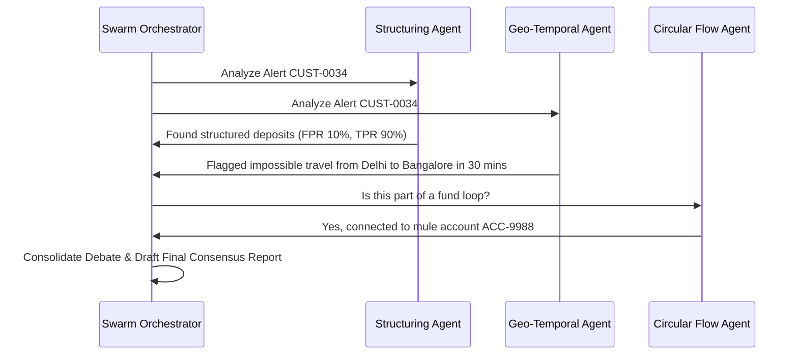

# 🛡️ SENTINEL MESH V2 — Cutting-Edge AI & Agent Integration Roadmap

This document outlines the advanced possibilities for integrating Deep Learning models, Graph Neural Networks (GNNs), and LLM-based autonomous agent swarms into different layers of the Sentinel Mesh cognitive AML architecture. These features represent the next phase of innovation for enterprise scale-up.

---

## 📅 Roadmap Overview

| Layer | Proposed AI Integration | Model/Tech Stack | AML Outcome |
|:---|:---|:---|:---|
| **L1: Ingestion** | KYC Document Intelligence | Multimodal LLMs, Azure Document Intelligence | Auto-extraction of identity parameters and document forgery detection |
| **L3: DNA Core** | Unsupervised Autoencoders | PyTorch TabNet / Dense Autoencoder | Dense embedding representations of behaviors, capturing complex anomalies |
| **L4: Knowledge Graph** | Graph Neural Networks (GNNs) | GraphSAGE, PyTorch Geometric | Predicting hidden collusive edges and classifying money-mule accounts |
| **L5: Agent Swarm** | Autonomous Multi-Agent Debate | Semantic Kernel, Multi-Agent Swarms | Explainable risk flagging through collaborative LLM reasoning |
| **L9: Feedback Loop** | Reinforcement Learning Tuning | Q-Learning, Bayesian Optimization | Automated, mathematical rule threshold and weight optimization |

---

## 🛠️ Detailed Layer Architectures

### 1. Layer 1: Ingestion — KYC Document Intelligence
Instead of manual verification or basic regex name matching, onboarding documents (passports, driver's licenses, utility bills) are parsed in real-time.

> [!TIP]
> **Implementation Strategy**:
> * Use **Azure AI Document Intelligence** pre-built KYC models to extract fields like Name, Date of Birth, ID number, and Issuing Authority.
> * Pass the document image to a **Visual LLM** to check for standard counterfeiting indicators (e.g. font inconsistencies, altered photos, or lack of watermarks).
> * Automatically populate `dim_customer` and flag high-risk anomalies (e.g. name variations) at entry.

---

### 2. Layer 3: DNA Core — Autoencoder Behavioral Vectors
Instead of defining the 12 behavioral dimensions with heuristic statistical calculations (sums, standard deviations), we allow deep learning to extract hidden features.

```text
Sequence of Transactions  ──►  [ Encoder (Neural Net) ]  ──►  12D Latent Vector (Behavioral DNA)
                                       │
                                       ▼
                              [ Decoder (Neural Net) ]  ──►  Reconstructed Sequence
                                       │
                                       ▼
                       Reconstruction Error > Threshold  ──►  DNA Drift Alert
```

> [!NOTE]
> **Implementation Strategy**:
> * Train a **PyTorch Autoencoder** on historical customer transaction sequences (amounts, channel codes, locations, times).
> * The middle layer of the autoencoder acts as the compressed **Latent Vector (Behavioral DNA)**.
> * When new transactions arrive, they are decoded. If the **reconstruction loss** (difference between real and predicted sequence) is high, it indicates a significant behavioral drift, triggering an alert.

---

### 3. Layer 4: Knowledge Graph — Graph Neural Networks (GNNs)
Classical graph queries are restricted to predefined path hops (e.g. A ➔ B ➔ C ➔ A). GNNs extract structural patterns across the entire graph.

> [!IMPORTANT]
> **Implementation Strategy**:
> * Build a GNN using **PyTorch Geometric** or **DGL (Deep Graph Library)** representing customers, devices, IPs, and accounts as nodes, and transactions as directed edges.
> * Run **Link Prediction** to discover hidden relationships: if Customer A and Customer B have no declared relationship but share structural neighbors, the GNN flags a high-probability "suspected_linked" relationship.
> * Run **Node Classification** to score accounts: the GNN learns structural motifs of known money mules and flags similar nodes as mules even if their transactions are below limits.

---

### 4. Layer 5: Agent Swarm — Multi-Agent Debate Swarm
Currently, agents are heuristic KQL functions. We can upgrade them to autonomous LLM agents that interact.



> [!TIP]
> **Implementation Strategy**:
> * Implement the 6 Swarm Agents as autonomous entities using **Semantic Kernel**.
> * When a customer triggers a flag, agents write down their evidence. 
> * The Orchestrator initiates a debate. The final output is not just a risk score, but a formatted markdown report outlining the arguments of each agent.

---

### 5. Layer 9: Feedback Loop — Reinforcement Learning Calibration
Rules-based recalibration uses linear adjustments. A Reinforcement Learning (RL) agent can optimize multi-dimensional thresholds.

> [!CAUTION]
> **Implementation Strategy**:
> * Define the environment as the `dim_adaptive_config` parameters.
> * The RL Agent (e.g., Q-learning or Deep Q-Network) modifies thresholds (e.g., raising/lowering velocity sigma, changing weights).
> * The **Reward Function** is calculated after daily analyst dispositions are submitted:
>   $$\text{Reward} = \alpha \times \text{True Positive Rate} - \beta \times \text{False Positive Rate}$$
> * The RL agent optimizes the reward, converging on the absolute best configuration settings that minimize analyst alert fatigue while maximizing detection rates.
