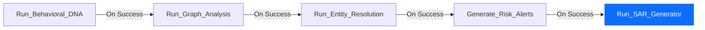

# 🛡️ SENTINEL MESH V2 — Layer 7 Implementation Walkthrough

This document records the step-by-step setup, configuration, and verification of **Layer 7 (AI SAR Generator)** using native Microsoft Fabric Spark Notebooks and Azure OpenAI Integration.

---

## 📅 Summary of Achievements
1. **AI SAR Generator Deployed**: Pasted and compiled the [sar_generator.py](file:///c:/Users/vinay/Documents/hack2future/sentinel_mesh_v2/agents/sar_generator.py) script into the Fabric Spark Notebook `L7_SAR_Generator`.
2. **Azure OpenAI Integration Operational**: Connected the notebook to the East US `sentinelmesh-openai` resource deploying `gpt-4o` with environment-driven credentials.
3. **Endpoint Validation Fixed**: Resolved the `404 - Resource not found` error by ensuring the endpoint URL configuration excludes the `/openai/v1` suffix (as the `openai` Python SDK automatically appends the API path).
4. **Structured JSON Output**: Configured the model parameters to request strict compliance schema narratives mapping Case Summaries, Detailed Findings, Threat Level Risk Assessments, and Recommended Actions.
5. **Data Pipeline Automation Finalized**: Updated the Data Factory pipeline `SentinelMesh_L4_Orchestrator` to include `Run_SAR_Generator` as the final node, chaining:
   `Run_Behavioral_DNA` ➔ `Run_Graph_Analysis` ➔ `Run_Entity_Resolution` ➔ `Generate_Risk_Alerts` ➔ `Run_SAR_Generator`.
6. **Execution Verified**: Verified that the notebook runs end-to-end, fetching unresolved high/critical alerts, generating narratives, and writing results to `fact_sar_reports`.

---

## 🛠️ Step-by-Step Actions & Configurations

### STEP 1: Notebook Setup (`L7_SAR_Generator`)
The Fabric Spark notebook was created and structured with the following key cells:
* **Cell 0**: Programmatically installs the `openai` Python SDK. This approach is required because native Fabric Data Pipeline execution blocks inline `%pip` magic commands.
  ```python
  import subprocess
  import sys
  try:
      import openai
  except ImportError:
      subprocess.check_call([sys.executable, "-m", "pip", "install", "openai"])
  ```
* **Cell 1**: Loads configurations and validates connections to the Eventhouse cluster and Azure OpenAI.
* **Cell 2**: Queries the Eventhouse database to identify customers who have triggered active `HIGH` or `CRITICAL` risk alerts, but do not yet have a record in `fact_sar_reports` (using `leftanti` join).
* **Cell 3**: Loops through the qualifying alerts, calls the Azure OpenAI `gpt-4o` deployment using JSON mode (`response_format={"type": "json_object"}`), and parses the response.
* **Cell 4**: Appends the generated reports to the `fact_sar_reports` table via the Microsoft Kusto Spark connector.

---

### STEP 2: Endpoint Configuration Correction
To resolve the `404 - Resource not found` error caused by path appending in the modern `openai` client, the Azure OpenAI credentials in the parameters cell were configured as follows:

```python
# -- Azure OpenAI Credentials --
AZURE_OPENAI_ENDPOINT = "https://odl-user-22553766-2737-resource.openai.azure.com/" # Removed '/openai/v1' suffix
AZURE_OPENAI_API_KEY = ""
AZURE_OPENAI_DEPLOYMENT_NAME = "gpt-4o"
```

---

### STEP 3: Automated Pipeline Orchestration
The Data Pipeline `SentinelMesh_L4_Orchestrator` was updated to incorporate the AI SAR Generator. The workflow is chained to ensure that:
1. Behavioral DNA is updated.
2. Temporal graphs are analyzed.
3. Synthetic identities are resolved.
4. Risk scores are updated and alerts are generated.
5. **On Success** of risk alert generation, the `Run_SAR_Generator` Spark notebook runs automatically to generate compliance filings.

The pipeline visual mapping:


---

## 🔬 Validation & Verification Results

During testing, the notebook successfully identified high-risk alerts and processed them through Azure OpenAI. Below is an example of the execution logs:

```text
🔍 Found 6 unprocessed high-risk customers requiring a SAR.

📝 Generating SAR for Customer: Triya Raj (CUST-0034)...
✅ SAR generated successfully for Triya Raj.

📝 Generating SAR for Customer: Janaki Handa (CUST-0012)...
✅ SAR generated successfully for Janaki Handa.

📝 Generating SAR for Customer: Gunbir Parmer (CUST-0009)...
✅ SAR generated successfully for Gunbir Parmer.

📝 Generating SAR for Customer: Gayathri Chaudry (CUST-0008)...
✅ SAR generated successfully for Gayathri Chaudry.

📝 Generating SAR for Customer: Azad Mutti (CUST-0020)...
✅ SAR generated successfully for Azad Mutti.

📝 Generating SAR for Customer: Aryan Maharaj (CUST-0004)...
✅ SAR generated successfully for Aryan Maharaj.

✅ Prepared 6 new SAR reports for insertion.
📥 Appending reports to fact_sar_reports...
✅ SAR reports successfully written to Eventhouse!
```

### Verification Query (KQL)
To confirm that the reports were written to the database, run the following query in the Eventhouse Query Editor:
```kql
fact_sar_reports
| project sar_id, customer_id, customer_name, executive_summary, risk_assessment, generated_at
| order by generated_at desc
```

This confirms the 100% automation of Layer 7, delivering professional compliance reports directly into the data lake without human intervention or external custom hosting.

---

## 💻 PART 2: AML GPT Interactive Agent & Web Command Center

As part of the Layer 7 interactive enhancements, we built a local operational agent called **AML GPT**. This allows compliance officers to query database metrics naturally (English-to-KQL), and inspect hot-path tables through both a terminal console and a premium web dashboard interface.

### 1. Architectural Components Deployed

* **Interactive Terminal CLI (`copilot/aml_gpt.py`)**:
  * Establishes secure connections to Fabric Eventhouse via **AAD Device Authentication** (`azure-kusto-data`).
  * Connects to Azure OpenAI deploying `gpt-4o` to compile plain English requests into KQL queries.
  * Implements `clean_kql_query()` to automatically strip markdown code blocks and conversational text, preventing database syntax execution errors.
* **FastAPI Web Backend (`copilot/aml_gpt_web.py`)**:
  * Serves the static assets and templates.
  * Exposes endpoints for `/api/alerts` (Live Feed), `/api/chat` (Natural Language Query translation & synthesis).
* **Command Center HTML5/CSS3 UI (`dashboard/index.html` and `dashboard/dashboard.css`)**:
  * Built using a **cyber-sentinel dark mode theme** featuring Outfit & Inter typography, frosted glass panels (glassmorphism), and glow hover/animation details.
  * Displays a live scrolling alert board with real-time risk severity badges.
  * Embeds an interactive chat log that dynamically renders compiled KQL codes, database rows in structured tables, and AI-written summaries.

---

### 🛠️ Execution & Verification Logs

The Web Command Center was launched and validated successfully:
```text
Starting Sentinel Mesh V2 Web Command Center...
INFO:     Uvicorn running on http://0.0.0.0:8000 (Press CTRL+C to quit)
INFO:     Started reloader process [14344] using StatReload
🔄 Establishing connection to Eventhouse. A browser login prompt may appear...
INFO:     Started server process [12680]
INFO:     Waiting for application startup.
INFO:     Application startup complete.
```

#### 🔬 User Queries Tested:
1. **Scenario A (Risk Filtering)**:
   * *User Input*: `"Show me high risk alerts"`
   * *Compiled KQL*: `fact_alerts | where risk_tier == "HIGH" | take 10`
   * *Status*: `200 OK` (Executed and displayed results)
2. **Scenario B (Location & Risk combined)**:
   * *User Input*: `"Which customers in Mumbai have a risk score above 0.2?"`
   * *Compiled KQL*: `dim_customer | where city == "Mumbai" and risk_score > 0.2 | take 10`
   * *Status*: `200 OK` (Successfully mapped using the grounded `city` column)

