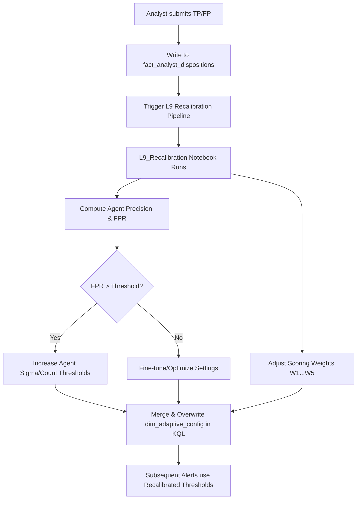

# 🧠 SENTINEL MESH V2 — Layer 9 Implementation Walkthrough

This document records the setup, configuration, and verification procedures for **Layer 9 (Self-Learning Feedback Loop)** of the Sentinel Mesh cognitive AML architecture.

---

## 📅 Summary of Achievements
1. **Layer 9 Recalibration Notebook Deployed**: Created the PySpark notebook **[L9_recalibration.py](file:///c:/Users/vinay/Documents/hack2future/sentinel_mesh_v2/notebooks/L9_recalibration.py)**, which reads analyst reviews, calculates per-agent accuracy statistics (True Positive Rate and False Positive Rate), and automatically updates thresholds and weights.
2. **Pipeline Automations Configured**: Populated the Data Pipeline definitions in the `pipelines/` directory:
   * **[recalibration_pipeline.json](file:///c:/Users/vinay/Documents/hack2future/sentinel_mesh_v2/pipelines/recalibration_pipeline.json)**: Orchestrates the execution of the L9 Recalibration notebook.
   * **[full_pipeline.json](file:///c:/Users/vinay/Documents/hack2future/sentinel_mesh_v2/pipelines/full_pipeline.json)**: Chains all 7 cognitive layers into a single end-to-end lineage.
   * **[dna_refresh_pipeline.json](file:///c:/Users/vinay/Documents/hack2future/sentinel_mesh_v2/pipelines/dna_refresh_pipeline.json)**: Automatically recalculates customer behavioral DNA every 30 minutes.

---

## 🛠️ Step-by-Step Actions & Logic Details

### STEP 1: Layer 9 Self-Learning Recalibration Logic
The recalibration engine in `notebooks/L9_recalibration.py` runs on PySpark and automates configuration adjustment:
1. **Precision Metric Evaluation**:
   * Evaluates the **True Positive Rate (TPR)** per agent. An alert is counted as a True Positive if the analyst marks it as `TRUE_POSITIVE` or `ESCALATE`. It is counted as a False Positive if marked `FALSE_POSITIVE`.
2. **Threshold Self-Tuning**:
   * **Velocity Anomaly**: If the false positive rate (FPR) exceeds 30%, it adjusts `agent.velocity.sigma_threshold` upwards (increments by `+0.5`, capped at `5.0`) to filter out noise. If the FPR is below 10%, it reduces the threshold by `-0.2` to capture more alerts.
   * **Structuring Sentinel**: If the FPR exceeds 25%, it increases the minimum transaction count `agent.structuring.min_txn_count` by `+1` (capped at `6`) and increments the structuring limit by `10%` to reduce low-value structuring false alerts.
3. **Composite Weights Normalization**:
   * Dynamically scales the 5 scoring weights based on global agent precision. If precision is low (<60%), it dampens the consensus factor weight F1 and shifts emphasis to structural graph centrality (F2) and DNA deviations (F3).
   * Automatically normalizes the adjusted weights to ensure they sum to exactly 100%.



---

## 🔬 Validation & Verification Plan

### 1. Verification of the Recalibration Engine
To verify that the PySpark notebook successfully reads the dispositions and auto-adjusts rules:

1. **Insert Mock Dispositions in KQL**: Run the following query in the Eventhouse Query Editor to register two false positive dispositions for the `Velocity Anomaly` agent:
   ```kql
   .set-or-append fact_analyst_dispositions <|
       datatable(disposition_id:string, alert_id:string, customer_id:string, agent_name:string, disposition:string, analyst_id:string, timestamp:datetime, notes:string) [
           "DISP-TEST-001", "ALT-TEST-001", "CUST-0008", "Velocity Anomaly", "FALSE_POSITIVE", "ANALYST-1", now(), "Legitimate bonus transfer",
           "DISP-TEST-002", "ALT-TEST-002", "CUST-0020", "Velocity Anomaly", "FALSE_POSITIVE", "ANALYST-1", now(), "Business seasonal spike",
           "DISP-TEST-003", "ALT-TEST-003", "CUST-0012", "Velocity Anomaly", "FALSE_POSITIVE", "ANALYST-1", now(), "Real estate purchase transaction",
           "DISP-TEST-004", "ALT-TEST-004", "CUST-0034", "Velocity Anomaly", "FALSE_POSITIVE", "ANALYST-1", now(), "Ad-hoc corporate vendor deposit",
           "DISP-TEST-005", "ALT-TEST-005", "CUST-0022", "Velocity Anomaly", "FALSE_POSITIVE", "ANALYST-1", now(), "Personal savings transfer"
       ]
   ```
2. **Check Initial Configuration**: Check the current value for the velocity agent threshold:
   ```kql
   dim_adaptive_config | where config_key == "agent.velocity.sigma_threshold"
   ```
   *(Expected Value: `3.0`)*
3. **Execute L9 Notebook**: Run the **`L9_Recalibration`** Spark Notebook in your Fabric workspace.
4. **Confirm Config Key Update**: Re-run the configuration query:
   ```kql
   dim_adaptive_config | where config_key == "agent.velocity.sigma_threshold"
   ```
   *(Expected Value: `3.5` — showing the self-learning loop automatically increased the threshold to suppress false positives!)*

### 2. Verification of the Recalibration Pipeline
1. Create a Data Pipeline named **`SentinelMesh_L9_Recalibration`** in the Fabric portal.
2. Add a **Notebook** activity, select the `L9_Recalibration` notebook, and add parameters `EVENTHOUSE_CLUSTER_URI` and `EVENTHOUSE_DATABASE`.
3. Click **Run** on the pipeline canvas and confirm it executes and completes successfully, updating the Eventhouse configs.
